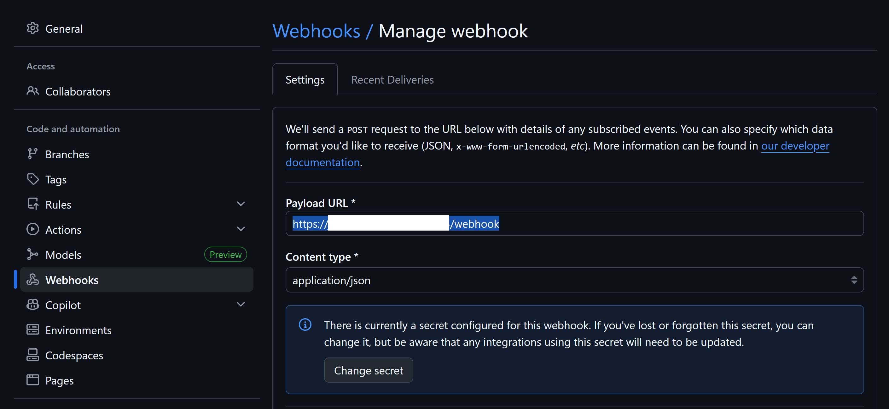
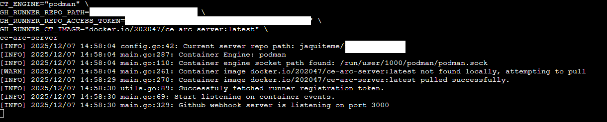

# Container Engine Actions Runner Controller (CE-ARC)

  

A lightweight autoscaling self‑hosted GitHub Actions runner controller using Podman or Docker.

---

## Table of Contents

* About
* Why this project
* Features
* Core components
* Quickstart
  * Option 1: Build from Source
  * Option 2: Use Prebuilt Binary
* Configuration
* Limitations
* TODO

---

## About

CE-ARC is a lightweight solution to automatically scale and provision self-hosted GitHub Actions runners based on queued jobs. It provides:

* A Go-based server that listens to GitHub workflow webhook events.
* Automatic registration of runners to a GitHub organization or private repository.
* Scripts to build GitHub runner container images.

## Why this project

* Built to meet personal needs: running GitHub workflows on private projects and accessing home lab infrastructure.
* Suitable for small teams and individuals with similar requirements.
* Self-hosted runners can reduce CI wait times by autoscaling runners when workflows are queued.

## Features

* Autoscaling based on queued jobs.
* Podman and Docker support.
* Easy webhook integration.
* Lightweight Go server.

## Core components

* A server configured once to listen to GitHub webhooks, verify event integrity, and automatically provision and register runners.

## Quickstart

:bulb: Use [ngrok](https://ngrok.com/docs/guides/device-gateway/linux) or any other reverse-proxy service to allow GitHub to send workflow events to ``ce-arc-server``.

### Option 1: Build from Source

**Prerequisites**

* [Go](https://go.dev/doc/install)
* Make

**Steps**

1. Install Podman:

```bash
make install
```

2. Build your runner image locally:

```bash
make build
```

3. Run the server with environment variables:

```bash
make run
  GH_WEBHOOK_SECRET="a-secret"
  CT_ENGINE="podman"
  GH_RUNNER_REPO_PATH="name/repo"
  GH_RUNNER_REPO_ACCESS_TOKEN="ghp_XXXXXXXXXXXXXX"
  GH_RUNNER_CT_IMAGE="localhost/gh-runner:latest"
```

### Option 2: Use Prebuilt Binary

1. Install Podman on your host ([installation guide](https://podman.io/docs/installation)).
2. Verify Podman rootless mode:

```bash
podman info | grep rootless
```

3. Enable Podman socket service:

```bash
systemctl --user enable --now podman.socket
```

4. Download the binary from the [release page](https://github.com/jaquiteme/container-engine-actions-runner-controller/releases).

```bash
VERSION="v1.0.0"
&& wget https://github.com/jaquiteme/container-engine-actions-runner-controller/releases/download/${VERSION}/ce-arc-server-${VERSION}-linux-amd64 -O ce-arc-server
&& sudo mv ./ce-arc-server /usr/local/bin
&& chmod +x /usr/local/bin/ce-arc-server
```

5. Create and configure a webhook with workflow events for your repository or organization ([GitHub docs](https://docs.github.com/en/webhooks/using-webhooks/creating-webhooks#creating-a-repository-webhook)).

On GitHub set Payload url with https://your-server-url/webhook




6. Create an access token with `repo` scope (private repositories) or `admin:org` scope (organizations) ([GitHub docs](https://docs.github.com/en/actions/reference/runners/self-hosted-runners#authentication-requirements)).

7. Start the server:

```bash
GH_WEBHOOK_SECRET="a-secret"
CT_ENGINE="podman"
GH_RUNNER_REPO_PATH="name/repo"
GH_RUNNER_REPO_ACCESS_TOKEN="ghp_XXXXXXXXXXXXXX"
GH_RUNNER_CT_IMAGE="docker.io/202047/gh-runner:latest"
ce-arc-server
```



8. Change your workflow code to use a self-hosted runner

```yaml
jobs:
  test-job:
    name: Test self-hosted runner
    runs-on: [self-hosted]
```

## Configuration

⚠️ Currently, values can only be provided via environment variables.

| Variable                  | Required | Description                     | Example                      |
|---------------------------|----------|---------------------------------|-----------------------------|
| `GH_RUNNER_REPO_PATH`     | ✅       | Target GitHub repo path          | `name/project`              |
| `GH_RUNNER_REPO_ACCESS_TOKEN` | ✅   | Access token with required scopes | `ghp_XXXXXXXXXXXXXX`        |
| `GH_RUNNER_CT_IMAGE`      | ✅       | Runner container image           | `docker.io/user/gh-runner:latest` |
| `CT_ENGINE`               | ❌       | Podman or Docker                 | `podman`                    |
| `GH_WEBHOOK_SECRET`       | ❌       | Webhook secret                  | `a-secret`                  |

## Limitations

* Configuration only via environment variables.
* Limited logging and monitoring.

## TODO

* Implement idle runner cleanup.
* Collect runner logs.
* Add YAML configuration support.
* Enhance monitoring and metrics.